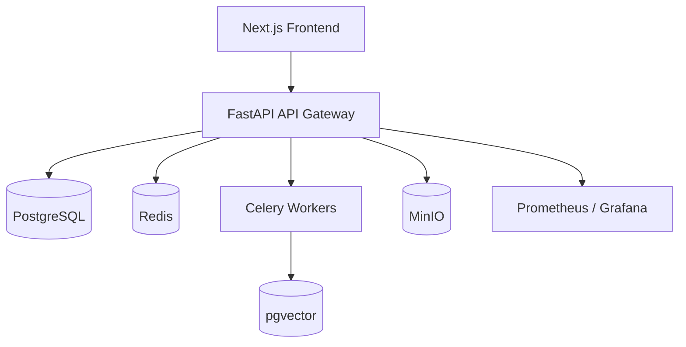

# Flowora
_Where AI Agents Flow Together_

Flowora is a production-ready platform for creating, running, and monetizing AI agents and workflows. It combines a FastAPI backend with a Next.js 14 frontend, enabling agent orchestration, marketplace distribution, billing, and observability in one system.

## Project Overview
Build AI agents, connect tools, run workflows, and ship them to a marketplace with usage-based billing and analytics. The platform supports autonomous agent execution, prompt optimization, vector memory, and multi-tenant SaaS foundations.

## Architecture Diagram


## Features
- Agent builder with prompt, tools, memory, and model controls
- Workflow builder with node-based orchestration
- Marketplace listings, installs, and reviews
- Wallet and billing with usage tracking
- Multi-tenant organizations and workspaces
- Continuous agent learning and prompt versioning
- Foundational observability and health checks
- Scheduled founder mode automation

## DEMO
- Dashboard preview
  
- Agent builder preview
  
- Workflow builder preview
  

Platform walkthrough:
1. Create an agent in the Agent Builder.
2. Run the agent and inspect execution logs.
3. Publish the agent to the marketplace.
4. Create a workflow and connect agents as nodes.
5. Monitor usage and revenue in Billing and Wallet.

## Installation Guide
See `docs/installation.md` for full instructions. For product usage, see `docs/usage.md`.

Quick overview:
```bash
# Backend
cd apps/backend
python -m venv .venv
. .venv/bin/activate  # Windows: .venv\\Scripts\\activate
pip install -r requirements.txt
uvicorn main:app --reload
```

```bash
# Frontend
cd apps/frontend
npm install
npm run dev
```

## Quick Start
```bash
# Local full stack
docker compose up -d --build

# Production-style deploy
cp .env.prod.example .env.prod
docker compose -f docker-compose.prod.yml --env-file .env.prod up -d --build
```

## Example Agents
- `examples/seo_agent`
- `examples/lead_generation_agent`
- `examples/blog_writer_agent`

## Example Workflows
- `examples/workflows/seo_audit_workflow.json`
- `examples/workflows/lead_funnel_workflow.json`

## Contributing Guide
1. Fork the repo and create a feature branch.
2. Run backend lint and tests before submitting.
3. Keep changes focused and document behavior changes.
4. Open a PR with a clear summary and test notes.

## License
MIT License. See `LICENSE`.
