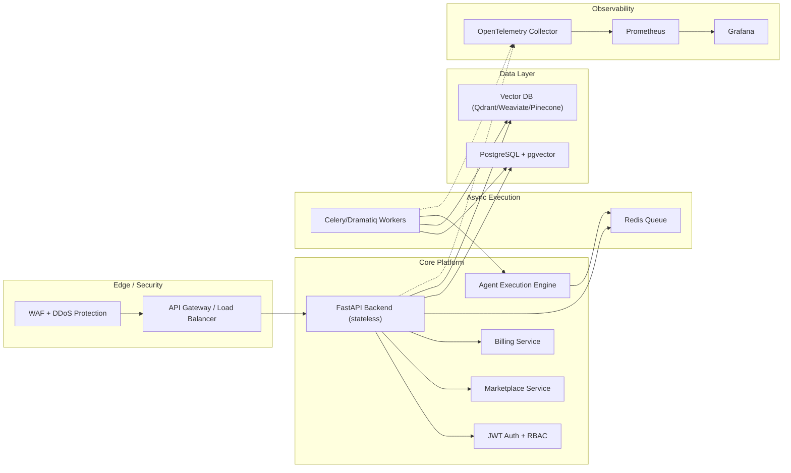

# Distributed AI Platform Architecture

This document defines the distributed architecture for the Flowora backend to support millions of runs, high availability, and enterprise-grade reliability.

**System Architecture Diagram**

**Execution Path**
1. Client requests hit API Gateway.
2. FastAPI handles synchronous work and enqueues heavy tasks into Redis.
3. Workers pick up tasks, run the Agent Brain, and persist execution logs to Postgres.
4. Memory operations are stored in pgvector and/or external vector DB.
5. Prometheus and Grafana provide observability with OpenTelemetry traces.

**Reliability Patterns**
- Stateless FastAPI pods enable rapid horizontal scaling.
- Redis queue isolates heavy workloads from API latency.
- Separate worker pools by queue (agent runs, workflows, compliance, simulations).
- Database replicas and read pools for analytic queries.
- Structured execution logs for auditability and replay.

**Security & Governance**
- JWT authentication + RBAC on every request.
- API rate limiting at gateway and app layers.
- Audit logs for admin actions and marketplace transactions.
- Secret management via K8s secrets or external vaults.

**Vector Memory Options**
- Default: Postgres with pgvector (simple operations and unified backup).
- Optional: Dedicated vector DB for large-scale semantic search (Qdrant/Weaviate/Pinecone).
