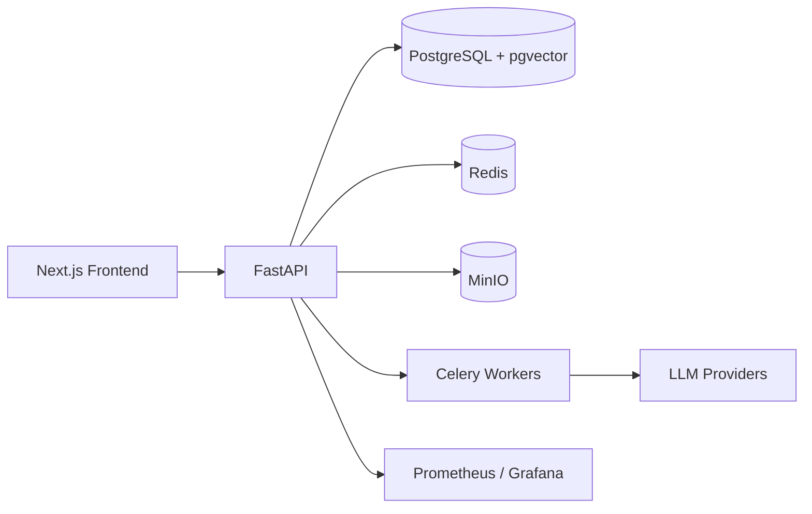

# Architecture
Flowora - Where AI Agents Flow Together.

Flowora is composed of a FastAPI backend, a Next.js frontend, and distributed worker services for async tasks.

## High-Level Architecture

## Key Services
- Agent Runtime Engine
- Tool Registry and execution handlers
- Marketplace and billing
- Vector memory and retrieval
- Founder Mode orchestration

## Data Stores
- PostgreSQL for core data
- pgvector for semantic memory
- Redis for caching and rate limiting
- MinIO for object storage
